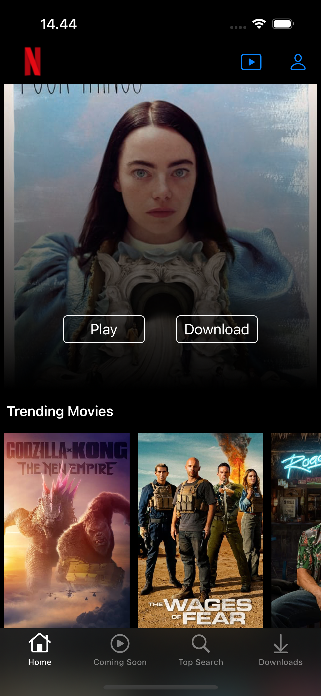
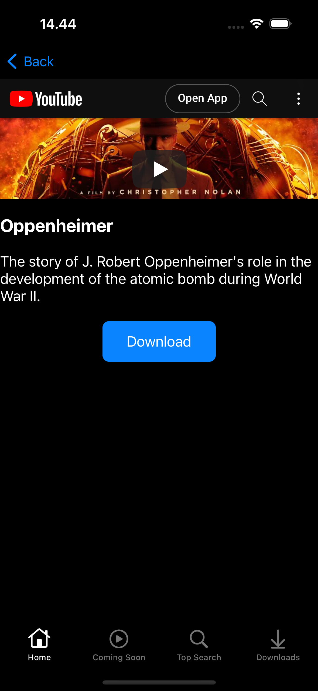

# Netflix Clone iOS Application Documentation

## Table of Contents

1. [Introduction](#introduction)
2. [Features](#features)
3. [Technologies Used](#technologies-used)
4. [Installation](#installation)
5. [Screenshots](#screenshots)
6. [References](#references)

## 1. Introduction 

This is a Netflix clone iOS application built using UIKit. The project aims to replicate the core functionalities of the popular streaming platform Netflix on iOS devices. Users can browse and search for movies and TV shows, view details, download items, and play trailer videos seamlessly.

## 2. Features 

- Browse and search for movies and TV shows
- View details of movies and TV shows, including trailers, and synopsis
- Add movies and TV shows to a download
- Play movies and TV shows trailer

## 3. Technologies Used 

- **UIKit**: UI framework for building iOS user interfaces
- **Core Data**: Framework for managing the download list
- **MVVM Clean Architecture**: Design pattern for separating concerns in the application
- **SDWebImage**: Library for asynchronous image loading & caching

## 4. Installation 

To run the Netflix clone project locally, follow these steps:

1. Clone the repository: `https://github.com/handy-darmawan/Netflix-Clone.git` in Terminal
2. Navigate to the project directory: `cd Netflix-Clone` in Terminal
3. Open the project workspace file: `open Netflix\ Clone.xcodeproj` in Terminal
4. Build and run the project on your iOS simulator or device using Xcode

## 5. Screenshots 
 

## 6. References 

### API References
- [The Movie Database API](https://www.themoviedb.org/documentation/api)
- [YouTube Data API](https://developers.google.com/youtube/v3)

### Video References
- [FreeCodeCamp.org youtube](https://www.youtube.com/watch?v=KCgYDCKqato&t=943s)
